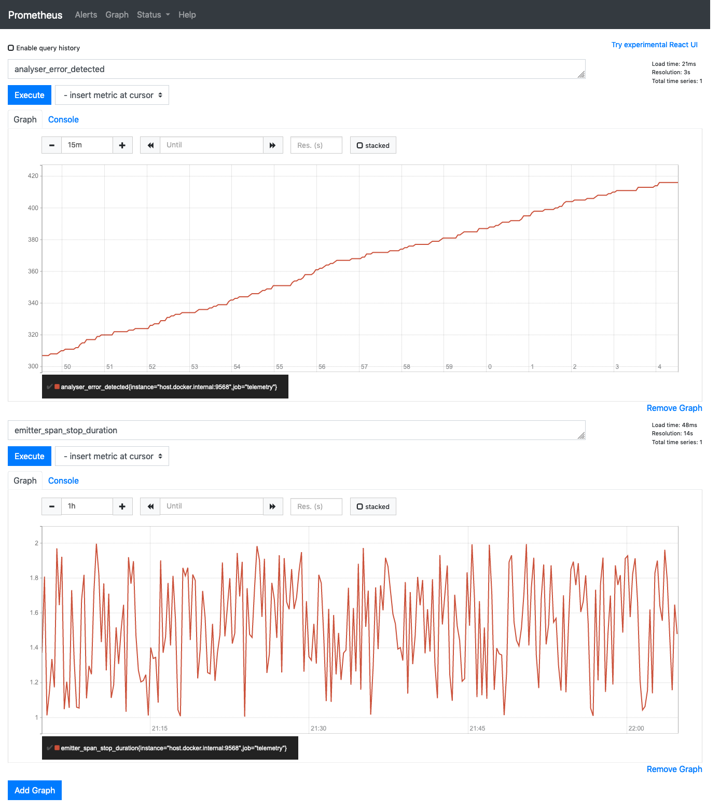

# TelemetryAnalysis

This repository serves the purpose of exploring the methods of analysis and inference based on event streams generated by massively concurrent systems in Erlang and Elixir technology.
It was created for a course at AGH UST.

This is a proof of concept project showcasing processing of Telemetry events.
It's an umbrella project containing the emitter as well as 
an analyser of Telemetry events.
The first one is written in Erlang and the latter in Elixir to explore the
interoperability of the BEAM based languages.

To run the emitter with the analyser simply execute:
```bash
iex -S mix
```
To run the Prometheus server to see the metrics execute the 
`prometheus-docker/run.sh` script. It will start a Prometheus docker instance
which will be available at port `9090`.

An example screenshot:

